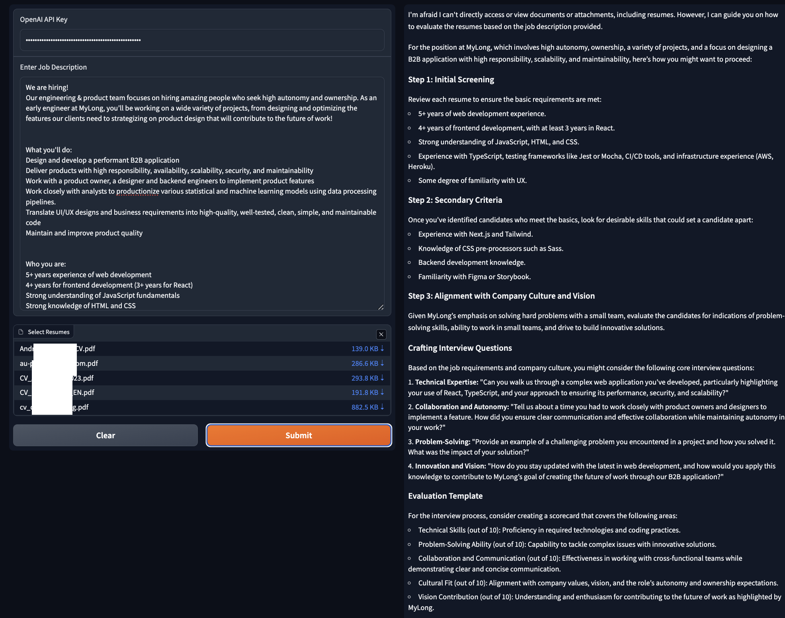

# Project Title

## Installation

This project uses pipenv for dependency management. If you don't have pipenv installed, you can install it with:

```sh
pip install pipenv

pipenv install

pipenv run python main.py
```

## Image Demo


